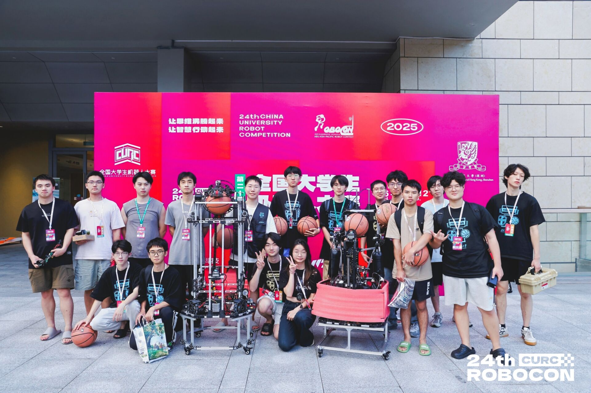
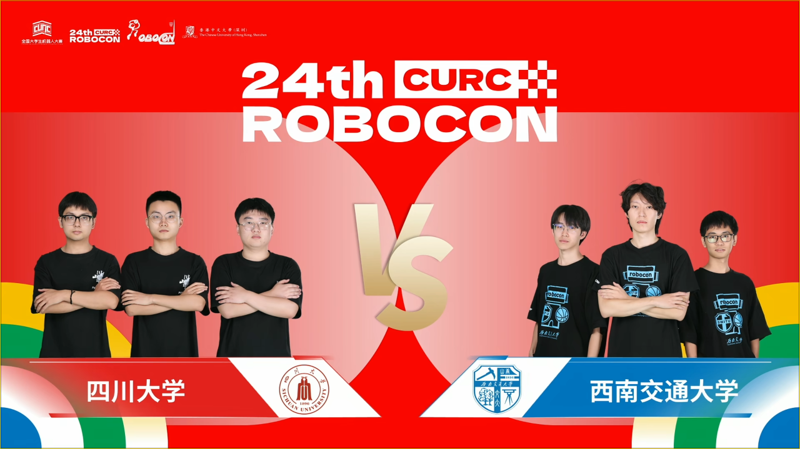
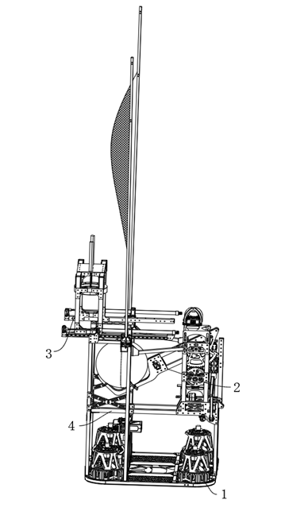

# 你好，我是范坤鹏

## 基本信息

- **姓名**: 范坤鹏
- **生日**: 2005-6-24
- **联系方式**:
  - QQ:2964924015
  - 微信：qq2964924015
  - 邮箱：2023112091@my.swjtu.edu.cn

---

##  我的教育背景——西南交通大学 \| 通信工程 \| 本科（2023.09 - 至今）

- **核心学业数据（前五学期）**
  
  | 课程均分 | 绩点 (GPA) | 专业排名 |
  | :--- | :--- | :--- |
  | **91.44 / 100** | **3.78 / 4.00** | **8 / 137** |
  
- **获得证书**
  
  | 英语四级 (CET-4) | 英语六级 (CET-6) | 计算机二级 (C语言) |
  | :--- | :--- | :--- |
  | **540** | **464** | **优秀** |
  
- **主修课程**: 
嵌入式系统设计与应用、模拟电子技术、数字电子技术、电路分析、电子系统设计与实践、计算机组成原理、计算机网络、信号与系统、信息论与编码、人工智能算法基础、复变函数与积分变换、数字信号处理、电磁场理论、计算机程序设计等

- **研究兴趣**:
  - 智能机器人与群体智能系统
  - 机器人控制技术
  - 机器人集群协同控制
  - 嵌入式系统

👉 [**查看我的详细教育经历与竞赛奖项**](details.md)

---

## 个人优势

以下是我在学术与实践中积累的核心竞争力：

- **学习能力突出**：在校总成绩位居前列，具备扎实的专业理论基础；
- **团队协作经验**：曾担任校机器人队电控组长及社团主席，拥有高效的团队沟通与组织协调能力；
- **工程实践能力**：积极投身于机器人领域各类高水平竞赛与科研项目，积累了丰富的工程调试经验；
- **抗压与解决问题能力**：具备在压力环境下独立分析并解决复杂工程问题的能力，能够快速适应高强度的科研节奏。

---

##  核心技能

### 编程语言

  
  
  

### 嵌入式控制

  
  
  
  

### 工具与工程

  
  
  
  
  
  
  

---

## 科创项目
-✨ **[第二十四届全国大学生机器人大赛ROBOCON]**
<table align="center" border="0" cellpadding="10">
  <tr>
    <td></td>
    <td></td>
  </tr>
</table>
  - 简要描述：围绕“飞身上篮”赛季主题，研发高度自主协同机器人系统。实现机器人在复杂赛场下自动取球、高精度传接球、高速运球及全自动投射，攻克了高动态工况下机构控制精度、全空间实时定位及多机协同动作等工程难题。
  - 本人工作：
    - 系统架构与硬件驱动： 基于 STM32 设计分布式控制架构，通过 **CAN** 总线调度 10 枚异构电机。融合了大疆电机、达妙电机与 VESC 驱动器，将控制周期稳定在 1ms，确保底层执行层的高带宽响应。
    - 运动控制与算法优化： 完成 4 全向轮底盘逆运动学建模，设计带前馈补偿的改进型 PID 算法。结合高频 IMU 反馈实时解算位姿，在 3m/s 高速移动中有效补偿底盘打滑，确保路径跟踪偏差控制在 2cm 以内。
    - 数据处理与精准定位： 构建基于**环形缓冲队列**的异步数据流处理框架，解决了数据延迟与粘包丢包问题。通过**插值算法**融合码盘与激光雷达数据，消除通信延迟与非同步误差，实现全空间高精度实时定位。
    - 高动态射击系统优化： 针对赛季“飞身上篮”需求，采用 VESC 电调控制无刷电机驱动高速摩擦轮方案。利用 VESC 的高频采样特性实现了高精度的转速闭环控制，显著提升了射球初速度的稳定性与一致性，支撑机器人实现全自动化、高频率的精准投射。
    
 

-✨ **[国家级大学生创新训练计划项目“基于矢量底盘的多功能篮球训练机器人”]**
<table align="center" border="0" cellpadding="10">
  <tr>
    <td align="center">
      
    </td>
    <td align="center">
      
    </td>
  </tr>
</table>
  - 简要描述：针对体育智能化训练需求，自主研制了一款集全向高机动位移、主动吸附运球、高精度抛射于一体的智能机器人。系统能够模拟运动员滑步走位、自动“拍球”运球并根据距离自动投篮，为体育数字化训练提供了高集成度的硬件方案。本项目聚焦高机动矢量底盘、复杂气动耦合控制及自适应建模投射三大核心领域进行科研攻关。
  - 本人工作：
    - 矢量底盘的运动学建模与控制：研发基于四个独立转向/驱动单元的舵轮矢量底盘，构建底盘**逆运动学解算**以实现平移、旋转及复合全向运动。融合3D激光雷达的空间位姿估计与码盘里程计数据，实现室内定位，支撑机器人在赛场环境下的快速移动与路径追踪。
    - 复杂时序逻辑下的执行策略： 为攻克“拍球”动作的动态模拟难题，自主设计了一套由真空泵、储气罐、稳压阀、单向阀及电磁阀组成的**多级气路系统**，并基于有限状态机构建精确时序控制策略，严格匹配气缸与真空吸盘吸附-释放的执行周期，实现高可靠的连续动态运球。
    - 基于非线性拟合的抛射轨迹预测模型：针对具备自锁特性的传动投石机机构（蜗轮蜗杆传动），利用激光雷达实时解算目标位姿并驱动底盘完成自主对齐闭环；通过多距离采样与**曲线拟合算法**，建立弹簧蓄力位移与真实抛射距离的数学映射模型，攻克了变距离目标的精准打击难题，实现全场动态环境下的自适应精准投射。
    
 

-✨ **[全国大学生创新年会 “球类辅助训练与物资运送一体化机器人” ]**

  
  

  - 简要描述：针对多任务体育训练场景，研发了一款集全向移动、自动拾发球与物资转运于一体的复合机器人。系统集成“麦轮拾球+摩擦轮发射”机构与双二自由度夹爪，实现了足球高效采集与物资自动化转运。
  - 本人工作：
    - 任务调度与逻辑开发：基于**状态机思想**设计多机构协同调度逻辑，有效解决了拾球、抓取、转运等多个动作间的时序冲突与物理干涉。
    - 执行机构控制优化： 负责二自由度夹爪驱动控制及射球**差速控制算法**编写；利用麦克纳姆轮分力特性优化了拨球入笼的稳定性，确保采集效率。
    - 运动调试与路径执行： 参与四全向轮底盘逆运动学调试，提升了机器人在狭窄、复杂场地下的路径执行精度与动作连贯性。
    

