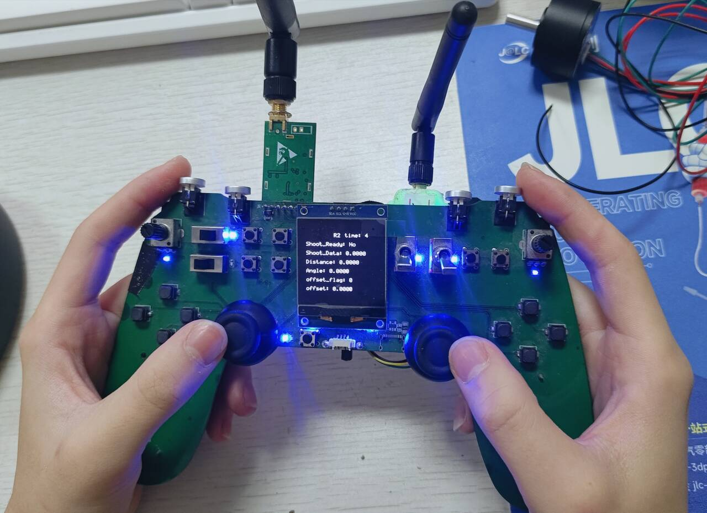

# 你好，我是范坤鹏

## 基本信息

- **姓名**: 范坤鹏
- **生日**: 2005-6-24
- **联系方式**:
  - QQ:2964924015
  - 微信：qq2964924015
  - 邮箱：2023112091@my.swjtu.edu.cn

---

##  我的教育背景——西南交通大学 \| 通信工程 \| 本科（2023.09 - 至今）

- **核心学业数据（前五学期）**
  
  | 课程均分 | 绩点 (GPA) | 专业排名 |
  | :--- | :--- | :--- |
  | **91.44 / 100** | **3.78 / 4.00** | **8 / 137** |
  
- **获得证书**
  
  | 英语四级 (CET-4) | 英语六级 (CET-6) | 计算机二级 (C语言) |
  | :--- | :--- | :--- |
  | **540** | **464** | **优秀** |
  
- **主修课程**: 
嵌入式系统设计与应用、模拟电子技术、数字电子技术、电路分析、电子系统设计与实践、计算机组成原理、计算机网络、信号与系统、信息论与编码、人工智能算法基础、复变函数与积分变换、数字信号处理、电磁场理论、计算机程序设计等

- **研究兴趣**:
  - 智能机器人与群体智能系统
  - 机器人控制技术
  - 机器人集群协同控制
  - 嵌入式系统

👉 [**查看我的详细教育经历与所获荣誉**](details.md)

##   工程与科研能力展示 
*点击下方各项目的 [Details] 可查看详细信息*

### 🚀 01. 第二十四届全国大学生机器人大赛 ROBOCON

<table border="0" width="100%">
  <!-- 上半部分：图文并排区 -->
  <tr>
    <!-- 关键修改：加入 word-break: break-all 解决换行空白问题 -->
    <td width="60%" valign="top" style="word-break: break-all;">
      <!-- 身份标识框 -->
      <table border="0" cellpadding="0" cellspacing="0" style="margin-bottom: 15px;">
        <tr>
          <td bgcolor="#555555" style="padding: 5px 15px; border-radius: 4px;">
            <b>项目职责：电控组长</b>
          </td>
        </tr>
      </table>
      <b>项目目标：</b>研发集远距离精准投射与全场动态拦截于一体的高度自主机器人，实现赛场高频率进攻打击与高机动防守封堵。 
      <h4>核心工作概览</h4>
      <ul>
        <li>完成 <b>四全向轮底盘逆运动学解算</b>，实现支撑机器人在 3m/s 高速移动下的进攻对位与防守横移。</li>
        <li>采用 <b>插值算法</b> 融合码盘与 3D 激光雷达空间位姿数据，通过时间戳对齐消除不同返回频率传感器的非同步误差，实现实时精准定位。</li>
        <li>构建基于 <b>环形缓冲队列</b> 的异步数据流框架，消除通信延迟与丢包。</li>
        <li>利用 <b>VESC</b> 高频采样实现摩擦轮转速精准闭环，支撑三分线远距离投射。</li>
      </ul>
    </td>
    <!-- 右侧：图片区 -->
    <td width="40%" valign="top" align="center">
      
       <i>比赛对阵图</i>
      
       <i>机器人投篮演示</i>
       
    </td>
  </tr>

 <!-- 下半部分：技术逻辑 (使用原生动态三角形) -->
  <tr>
    <td colspan="2">
      

        <!-- 
          重点：通过 display: list-item 强制显示系统三角形。
          不手动添加 ▶，这样系统三角形旋转时就不会有另一个符号在旁边碍眼。
          文字颜色设置为深蓝色 #0366d6。
        -->
        

          <b>实战复盘</b>
        

        
        <table border="0" width="100%" bgcolor="#f3f4f5">
          <tr>
            <!-- 同样加入 word-break 防止详情页换行问题 -->
            <td style="padding: 15px; word-break: break-all;">
               
              <b> 赛场任务</b> 
              本届 ROBOCON 赛题要求机器人既要在三分线外完成精准投射，又要在防守端有效拦截对方投射。为此，机器人采用了<b>高身形</b>的物理结构，这在提升防守面积的同时，也给底盘动态稳定性与定位精度带来了极致挑战。
                
              <b> 挖掘问题</b> 
              1. <b>动力学失稳：</b> 高重心结构导致机器人在频繁移动的启停瞬间会产生巨大惯性力矩，导致底盘“翘头”震荡与停止过冲。 
              2. <b>非同步误差：</b> 码盘与3D激光雷达的采样频率不一致。在高速移动中，若直接融合会导致定位反馈存在明显的<b>阶跃感</b>和<b>时间滞后</b>，严重影响定位精度。 
              3. <b>射击一致性：</b> 远距离投射要求摩擦轮电机有极高且稳定的转速，传统电调在负载突变时落点漂移严重，无法保证重复落点精度。 
              4. <b>通信可靠性：</b> 赛场电磁环境复杂，传感器串行数据流易出现粘包及丢包现象，破坏控制闭环。
                
              <b> 设计思路</b> 
              高动态性能的本质是<b>“系统加速度的平滑性”与“响应的确定性”</b>。必须通过运动学规划消除瞬时冲击力，通过高性能驱动器保证执行精度，并通过异步架构加固数据链路。
                
              <b> 技术实施</b> 
              - <b>底盘控制：</b> 采用<b>斜坡规划算法 (Ramp Planning)</b> 平滑加速度曲线，配合<b>含前馈的PID</b>，从源头抑制翘头现象并提高响应速度，提升机器人高动态移动稳定性。 
              - <b>定位融合：</b> 引入<b>线性插值算法</b>处理码盘数据（200Hz）与3D激光雷达（10Hz）空间位姿数据。通过存储历史帧，对雷达回传时刻进行时间戳回溯对齐，消除了非同步误差，实现了精准的空间定位。 
              - <b>通信框架：</b> 构建<b>环形缓冲队列异步数据流框架</b>，实现多源异构数据解耦与时间戳对齐，解决了复杂环境下的定位失效问题。 
              - <b>射击驱动：</b> 选用 <b>VESC 驱动器</b>实现毫秒级转速闭环，利用其高频采样能力确保摩擦轮在连续发射工况下初速度及射出角度的一致性。 
               
            </td>
          </tr>
        </table>
      

    </td>
  </tr>
</table>

### 🏀 02. 国家级大创：基于矢量底盘的多功能篮球训练机器人

<table border="0" width="100%">
  <!-- 上半部分：图文并排区 -->
  <tr>
    <!-- 左侧：图片/GIF区 (垂直居中) -->
    <td width="45%" align="center" valign="middle">
      
      
<i>遥控器系统</i>

      
       <i>机器人自主抛射演示</i>
    </td>
    
    <!-- 右侧：概览文字区 (valign="top" 确保标识框在右上角) -->
    <td width="55%" valign="top" style="word-break: break-all; padding-left: 10px;">
      
      <!-- 身份标识框 -->
      <table border="0" cellpadding="0" cellspacing="0" style="margin-bottom: 15px;">
        <tr>
          <td bgcolor="#555555" style="padding: 5px 15px; border-radius: 4px;">
            <b>项目职责：电控负责人</b>
          </td>
        </tr>
      </table>
      
      <b>项目描述：</b>自主研制集全向高机动位移、主动吸附运球、高精度抛射于一体的智能机器人。 
      
      <h4>核心工作：</h4>
      <ul>
        <li><b>矢量底盘建模：</b> 独立转向驱动单元的逆运动学解算，实现全向机动。</li>
        <li><b>操控交互优化：</b> 开发 ADC 采样遥控系统，引入 <b>一阶低通滤波</b> 滤除硬件噪声，并设计 <b>S型曲线</b> 进行控制量映射，实现了爆发响应与精准微操的平衡。</li>
        <li><b>气动耦合控制：</b> 精确时序策略控制真空泵与电磁阀，实现高可靠“拍球”。</li>
        <li><b>轨迹预测模型：</b> 利用<b>曲线拟合算法</b>建立弹簧蓄力与距离的数学映射。</li>
      </ul>
    </td>
  </tr>

  <!-- 下半部分：技术逻辑 -->
  <tr>
    <td colspan="2">
      

        

          <b>问题提出与突破 (Why-How-What)</b>
        

        
        <table border="0" width="100%" bgcolor="#f3f4f5">
          <tr>
            <td style="padding: 15px; word-break: break-all;">
               
              <b>❓ 需求驱动 (Why)</b> 
              针对体育智能化训练需求，研制一款集高机动位移、主动吸附运球与精准抛射于一体的智能终端，复现运动员滑步与投篮动作。
                
              <b>⚠️ 核心痛点 (How)</b> 
              1. <b>全向机动性：</b> 如何在室内环境下实现负载更高、指向更精准的矢量移动以复现滑步动作。 
              2. <b>动态耦合：</b> “拍球”动作涉及气动吸附与释放的微秒级时序配合，且投篮距离的变化对机构建模提出了自适应要求。 
              3. <b>操控线性感差：</b> 遥控器 ADC 采样存在硬件底噪，且简单的线性映射导致机器人起步过快，难以在篮下进行微小位置控制。 
               
              <b>🤔 机理洞察 (Observation)</b> 
              体育机器人的核心在于<b>“柔性动作的刚性实现”</b>。即通过精确的数学模型（轨迹拟合）复现运动员的投篮直觉，通过严格的逻辑序列（状态机）复现高频运球节奏。
                
              <b>💡 方法提出 (What)</b> 
              - <b>底盘层：</b> 完成<b>独立舵轮逆运动学解算</b>，配合 3D 激光雷达位姿估计，支撑机器人在赛场环境下的快速移动与路径追踪。 
              - <b>逻辑层：</b> 构建由真空泵、电磁阀等组成的<b>多级气路时序控制策略</b>，基于有限状态机严格匹配吸附-释放周期。 
              - <b>交互层：</b> 针对摇杆ADC值波动痛点，引入<b>一阶低通滤波算法</b>。通过平滑处理摇杆采样数据，有效滤除了高频噪声，并配合<b>S型指数曲线</b>重新映射速度控制量，使机器人在低速区获得极佳微调精度，高速区保持全速响应。 
              - <b>算法层：</b> 通过多距离采样与<b>曲线拟合算法</b>，建立弹簧蓄力位移与真实抛射距离的三次模型，解决自适应精准打击。
                
              <b>📈 价值总结 (So what)</b> 
              凭借自主研发的稳健控制系统，项目以“优秀”等级结题。验证了矢量底盘在复杂场景下的优越性，方案可推广应用于多种智能体育辅助设备。
               
            </td>
          </tr>
        </table>
      

    </td>
  </tr>
</table>

### 📦 03. 全国大学生创新年会项目：“球类辅助训练与物资运送一体化机器人”

<table border="0" width="100%">
  <!-- 上半部分：项目概览 + 图片 -->
  <tr>
    <td width="60%" valign="top" style="word-break: break-all; text-align: justify;">
      <!-- 身份标识框 -->
      <table border="0" cellpadding="0" cellspacing="0" style="margin-bottom: 15px;">
        <tr>
          <td bgcolor="#555555" style="padding: 5px 15px; border-radius: 4px;">
            <b>项目职责：核心成员</b>
          </td>
        </tr>
      </table>
      
      <b>项目描述：</b>针对多任务体育训练场景，研制的一款集<b>麦轮拾球、摩擦轮发射与双二自由度夹爪转运</b>于一体的复合机器人。系统通过多机构协同调度算法，实现了复杂场地内拾发球任务与物资自动化转运的平稳衔接。 
      
      <h4 style="margin-top: 15px;">核心工作概览</h4>
      <ul>
        <li><b>多任务逻辑开发：</b> 基于 <b>有限状态机</b> 设计多机构协同调度逻辑，解决了拾球、抓取、转运任务间的时序冲突。</li>
        <li><b>执行机构控制：</b> 负责二自由度夹爪驱动及射球 <b>差速控制算法</b> 编写，利用麦轮分力特性显著提升了拨球入笼稳定性。</li>
        <li><b>路径执行优化：</b> 参与底盘逆运动学调试，通过对速度指令的平滑处理，提升了机器人在狭窄、复杂场地下的动作连贯性。</li>
      </ul>
    </td>

    <td width="40%" valign="middle" align="center">
            
      
    </td>
  </tr>

 <!-- 下半部分：技术细节（不走 Why-How-What 流程，直接讲干货） -->
  <tr>
    <td colspan="2">
      

        

          <b>技术细节</b>
        

        
        <table border="0" width="100%" bgcolor="#f3f4f5">
          <tr>
            <td style="padding: 15px; word-break: break-all;">
               
              <b> 核心调度逻辑：三级状态机设计</b> 
              针对拾球机构与转运夹爪在有限空间内的<b>扫掠干涉<b>问题，设计并实现了一套<b>三级递进式状态机调度架构<b>，从底层驱动到高层策略构建了严密的物理保护机制：
              <ul>
                <li><b>原子动作层：</b> 实现对单个执行器（如 M3508 电机、达妙电机）的状态封装与实时监控；</li>
                <li><b>任务序列层：</b> 将多个原子动作组合为具有业务意义的功能序列，实现复杂任务的模块化封装；</li>
                <li><b>互斥策略层：</b> 作为决策仲裁核心，通过建立“动作互斥”逻辑，强制执行升降与旋转的异步调度，在规避扫掠干涉的同时实现了冲突自锁保护。</li>
              </ul>
               
              <b> 机构优化：射球差速与麦轮拨球</b> 
              在处理球类采集时，利用滚轮侧向分力实现自动拨球对齐。同时，针对不同重量的球类，在射球控制中加入了<b>差速补偿</b>，通过调整双摩擦轮的转速比，有效控制了出球的旋转与轨迹稳定性。
                
              <b> 项目总结</b> 
              该项目最终成功入选<b>全国大学生创新年会改革成果展示</b>。团队在<b>多机构耦合控制</b>和<b>任务解耦设计</b>上积累了宝贵的工程经验，相关状态机思想已应用到后续多个复合移动平台中。
               
            </td>
          </tr>
        </table>
      

    </td>
  </tr>
</table>

---

## 个人优势

以下是我在学术与实践中积累的核心竞争力：

- **学习能力突出**：在校总成绩位居前列，具备扎实的专业理论基础；
- **团队协作经验**：曾担任校机器人队电控组长及社团主席，拥有高效的团队沟通与组织协调能力；
- **工程实践能力**：积极投身于机器人领域各类高水平竞赛与科研项目，积累了丰富的工程调试经验；
- **抗压与解决问题能力**：具备在压力环境下独立分析并解决复杂工程问题的能力，能够快速适应高强度的科研节奏。

---

##  核心技能

### 编程语言

  
  
  

### 嵌入式控制

  
  
  
  

### 工具与工程

  
  
  
  
  
  
  

